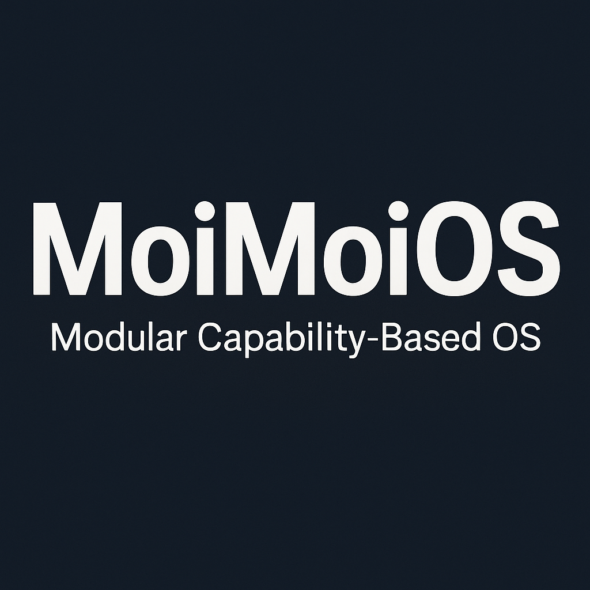

# MoiMoiOS

<!-- MoiMoiOS README -->
<h1 align="center">
   
  <b>MoiMoiOS</b>
</h1>

  <i>Modular Capability-Based Operating System</i> 
  <b>Built from Scratch · Secure · Lightweight · Auditable</b>

## What is MoiMoiOS?

**MoiMoiOS** is a modular, secure, lightweight operating system designed from the ground up.  
It centers around a **capability-based security model** where apps request privileges through the auditable **Chest** service.

Rather than giving blanket superuser access, MoiMoiOS empowers fine-grained, user-controlled privilege elevation.

---

## Features
- Lightweight custom microkernel
- Capability-based access control
- Secure Chest service for privileged actions
- Structured service traps instead of legacy syscalls
- Modular service-driven architecture
- Designed for both embedded and desktop environments

---

## Project Structure

kernel/ core/          --> Core kernel (init, trap dispatcher, scheduler) services/ chest/       --> Chest privilege service security/    --> Token and access control systems drivers/       --> Device and memory management

userspace/ chest_manager/ --> GUI/CLI for managing Chest access shell/         --> (planned) system shell

build/ Makefile       --> Kernel build instructions

docs/ design.md      --> OS design philosophy security.md    --> Chest security model

---

## Current Status
- [x] Kernel initialization
- [x] Trap system dispatcher
- [x] Chest service basic framework
- [ ] Memory manager (WIP)
- [ ] Process/task scheduler (planned enhancements)
- [ ] Shell and userspace apps
- [ ] Secure bootloader (future goal)

---

## License

MoiMoiOS is released under the **MIT License**.  
Feel free to fork, extend, and experiment — all contributions are welcome.

---

**Designed and Engineered with Precision**  
_The MoiMoiOS Team, 2025._

---
